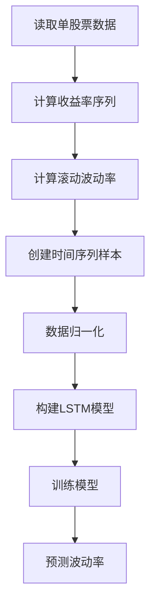
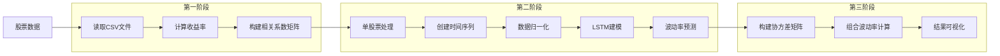

# 26-LSTM预测波动率股票

### 代码逻辑与流程图

#### 一、代码逻辑分析
该代码实现了基于LSTM的股票组合波动率预测，分为3个阶段：

**第一阶段：数据预处理与相关系数计算**
1. 读取30只股票的收盘价数据
2. 计算每只股票的对数收益率：
   $$ r_t = \ln(p_t) - \ln(p_{t-1}) $$
3. 构建全市场收益率矩阵（30列×T行）
4. 计算相关系数矩阵：
   $$ \rho_{ij} = \frac{\text{cov}(r_i, r_j)}{\sigma_i \sigma_j} $$

**第二阶段：单股票LSTM建模**

**第三阶段：组合波动率计算**
1. 使用预测波动率构建协方差矩阵：
   $$ \Sigma = \text{diag}(\sigma_i) \cdot \rho \cdot \text{diag}(\sigma_j) $$
2. 计算组合波动率：
   $$ \sigma_p = \sqrt{\mathbf{w}^T \Sigma \mathbf{w}} $$
3. 可视化对比预测与真实值

#### 二、完整流程图

### LSTM原理详解

#### 一、核心思想
长短期记忆网络（Long Short-Term Memory）是RNN的改进型，通过引入门控机制解决传统RNN的梯度消失问题。其关键创新在于细胞状态（Cell State）和三个门控结构：

#### 二、理论

长短时记忆网络（Long Short-Term Memory, LSTM）由 Hochreiter 和 Schmidhuber 于 1997 年提出，是一种特殊的递归神经网络（Recurrent Neural Network, RNN），旨在解决传统 RNN 在长期依赖问题上因梯度消失或梯度爆炸所导致的训练困难。传统 RNN 通过循环连接在时间步之间传递信息，但在长序列任务中，梯度在反向传播过程中呈指数级衰减，使得网络难以捕捉远距离的依赖关系。LSTM 通过门控机制对信息进行精确调控，确保重要信息可以长时间保留，从而有效解决上述问题。  

LSTM 的核心思想是引入 **遗忘门（Forget Gate）、输入门（Input Gate）和输出门（Output Gate）** 以动态调整信息的存储与更新过程，并通过 **细胞状态（Cell State）** 作为长期记忆存储单元，从而在长期依赖建模中具有更强的能力。设当前时刻输入为  $\mathbf{x}_t$ ，前一时刻的隐藏状态为 $\mathbf{h}_{t-1}$ ，前一时刻的细胞状态为 $\mathbf{C}_{t-1}$ ，则 LSTM 的计算过程可表示如下。  

首先，**遗忘门** 负责决定当前时刻是否丢弃前一时刻的细胞状态信息，其计算公式如下：  

$$
\mathbf{f}_t = \sigma \left( \mathbf{W}_f [\mathbf{h}_{t-1}, \mathbf{x}_t] + \mathbf{b}_f \right)
$$
其中， $\sigma$ 表示 Sigmoid 激活函数，$\mathbf{W}_f$ 和 $\mathbf{b}_f$  分别为遗忘门的权重矩阵和偏置项，\( $\mathbf{f}_t$ \) 取值范围在 \( (0,1) \) 之间，其值越接近 1，表示前一时刻的细胞状态信息越大概率被保留，否则越接近遗忘。  

其次，**输入门** 用于更新当前时刻新输入的信息，即决定哪些新的信息需要加入到细胞状态中。输入门的计算由两部分组成，第一部分是计算输入门的权重，第二部分是生成候选细胞状态。其计算公式如下：

$$
\mathbf{i}_t = \sigma \left( \mathbf{W}_i [\mathbf{h}_{t-1}, \mathbf{x}_t] + \mathbf{b}_i \right)
$$

$$
\tilde{\mathbf{C}}_t = \tanh \left( \mathbf{W}_C [\mathbf{h}_{t-1}, \mathbf{x}_t] + \mathbf{b}_C \right)
$$

其中， $\mathbf{i}_t$ 是输入门的激活值，同样通过 Sigmoid 函数限制在 （0,1） 之间，以决定新信息的保留程度。而  $\tilde{\mathbf{C}}_t$ 为候选细胞状态，由  $\tanh$ 激活函数计算，其取值范围在 (-1,1)  之间，以确保新信息在不同情况下可以具有较强的表达能力。  

基于遗忘门和输入门的信息更新机制，**细胞状态** 在当前时刻进行更新，计算如下：

$$
\mathbf{C}_t = \mathbf{f}_t \odot \mathbf{C}_{t-1} + \mathbf{i}_t \odot \tilde{\mathbf{C}}_t
$$
其中， $\odot$ 表示逐元素相乘（Hadamard 乘积），该计算公式表明，细胞状态由两部分组成：一部分是前一时刻的细胞状态经过遗忘门的调控后保留下来的信息，另一部分是当前时刻通过输入门更新的新信息。这一计算方式确保了 LSTM 能够选择性地保留长期信息，并在有需要时进行更新。  

最后，**输出门** 负责计算当前时刻的隐藏状态，即模型的最终输出：
$$
\mathbf{o}_t = \sigma \left( \mathbf{W}_o [\mathbf{h}_{t-1}, \mathbf{x}_t] + \mathbf{b}_o \right)
$$

$$
\mathbf{h}_t = \mathbf{o}_t \odot \tanh(\mathbf{C}_t)
$$

其中， $\mathbf{o}_t$ 通过 Sigmoid 计算，决定细胞状态的哪部分信息需要输出，而  $\mathbf{h}_t$ 作为隐藏状态，将结合当前时刻的细胞状态信息并进行非线性变换后传递至下一时刻。  

相比于传统 RNN，LSTM 通过门控机制在信息存储和更新过程中实现了更精准的控制，极大地缓解了梯度消失问题，使得模型在长时间依赖任务中表现更为优越。此外，LSTM 结构中包含多个非线性变换层和参数矩阵，使得其参数规模相较于普通 RNN 更大，因此训练时计算量也相应增加。尽管如此，LSTM 在诸多序列建模任务（如自然语言处理、语音识别、金融时间序列预测等）中展现了卓越的性能，成为了处理时间序列问题的主流方法之一。  

为了进一步提升 LSTM 的建模能力，研究者提出了一系列改进模型，例如双向 LSTM（Bidirectional LSTM, BiLSTM）通过前向和后向传播信息增强对全局序列的理解能力，门控循环单元（Gated Recurrent Unit, GRU）在保留 LSTM 主要特性的基础上减少了参数，提高了计算效率。此外，在更复杂的应用场景下，LSTM 也常与 **注意力机制（Attention Mechanism）** 结合，以进一步增强对关键时间步信息的捕捉能力。  

综上所述，LSTM 通过其独特的门控机制有效地解决了传统 RNN 在长序列任务上的梯度消失问题，使得模型能够保留长期依赖信息，从而在多个领域得到广泛应用。尽管 LSTM 仍然存在计算复杂度较高等问题，但其在序列建模任务中的卓越性能使其成为深度学习领域不可或缺的重要组成部分。

## **模型设计的思路**

该LSTM模型采用双层堆叠架构设计，其数学表达如下：

**输入层**：
接收标准化后的收益率序列 $\mathbf{X}_t \in \mathbb{R}^{60 \times 1} $，其中：
$$
\mathbf{X}_t = [r_{t-59}, r_{t-58}, ..., r_t]^T
$$
 $r_t$ 表示第$t$日的对数收益率

**第一层LSTM**（64单元）：
每个时间步  $\tau$  计算：
$$
\begin{aligned}
\mathbf{f}_\tau &= \sigma(\mathbf{W}_f [\mathbf{h}_{\tau-1}, \mathbf{x}_\tau] + \mathbf{b}_f) \\
\mathbf{i}_\tau &= \sigma(\mathbf{W}_i [\mathbf{h}_{\tau-1}, \mathbf{x}_\tau] + \mathbf{b}_i) \\
\mathbf{\tilde{c}}_\tau &= \tanh(\mathbf{W}_c [\mathbf{h}_{\tau-1}, \mathbf{x}_\tau] + \mathbf{b}_c) \\
\mathbf{c}_\tau &= \mathbf{f}_\tau \odot \mathbf{c}_{\tau-1} + \mathbf{i}_\tau \odot \mathbf{\tilde{c}}_\tau \\
\mathbf{o}_\tau &= \sigma(\mathbf{W}_o [\mathbf{h}_{\tau-1}, \mathbf{x}_\tau] + \mathbf{b}_o) \\
\mathbf{h}_\tau &= \mathbf{o}_\tau \odot \tanh(\mathbf{c}_\tau)
\end{aligned}
$$

其中 $\mathbf{W}_* \in \mathbb{R}^{64 \times (64+1)}$ ，$\mathbf{b}_* \in \mathbb{R}^{64}$ ，输出序列 $\mathbf{H}^{(1)} \in \mathbb{R}^{60 \times 64}$ 

**第二层LSTM**（32单元）：
接收 $\mathbf{H}^{(1)}$ 作为输入，计算：
$$
\mathbf{h}_t^{(2)} = \text{LSTM}(\mathbf{h}_{59}^{(1)}, \mathbf{h}_{58}^{(1)}, ..., \mathbf{h}_0^{(1)})
$$
最终状态 $\mathbf{h}_t^{(2)} \in \mathbb{R}^{32}$

**输出层**：
通过全连接层映射到波动率预测值：
$$
\hat{\sigma}_t = \mathbf{W}_o \mathbf{h}_t^{(2)} + b_o
$$

其中  $\mathbf{W}_o \in \mathbb{R}^{1 \times 32} ，b_o \in \mathbb{R}$ 

**优化目标**：
最小化均方误差：
$$
\mathcal{L} = \frac{1}{N} \sum_{t=1}^N (\hat{\sigma}_t - \sigma_t^{\text{true}})^2
$$

---

该公式体系展示了从原始收益率序列到波动率预测的端到端映射过程，通过两层LSTM逐步提取时序特征：第一层捕获局部波动模式$\mathbf{H}^{(1)}$ 保留时间维度信息），第二层进行全局特征融合$\mathbf{h}_t^{(2)}$ 聚合60步时序特征，最终通过线性投影输出波动率预测值。这种设计使得模型既能捕捉收益率序列的短期波动特征，又能学习长期风险演化模式。

